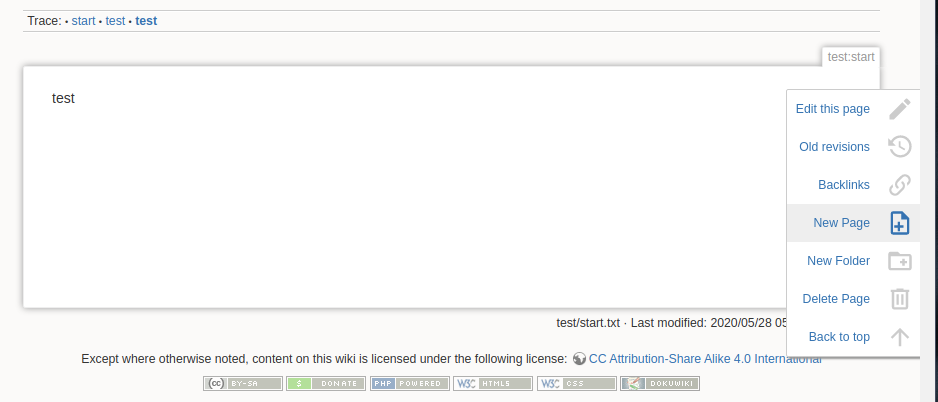

# Page Buttons Plugin for DokuWiki

The plugin adds a few Page Menu buttons to perform useful actions:

* _Delete Page_ - Deletes the current page
* _New Page_ - Creates a 'subpage' under the current namespace
* _New Folder_ - Creates a 'subfolder' under the current namespace

## License

This program is free software; you can redistribute it and/or modify
it under the terms of the
[GNU General Public License, version 2](https://www.gnu.org/licenses/old-licenses/gpl-2.0.html)
or later.

This program is distributed in the hope that it will be useful,
but WITHOUT ANY WARRANTY; without even the implied warranty of
MERCHANTABILITY or FITNESS FOR A PARTICULAR PURPOSE.  See the
GNU General Public License for more details.

## Installation and Configuration

If you install this plugin manually, make sure it is installed in
`lib/plugins/pagebuttons/` - if the folder is called differently,
it will not work!

## Compatibility

This plugin has been developped and tested with DokuWiki release 
*2018-04-22b "Greebo"* and should work with later versions as well.

Earlier releases are not supported.

## Support

Source code and support for this plugin can be found at
https://github.com/SoarinFerret/dokuwiki-plugin-pagebuttons

## Credits

Icons: 
* https://materialdesignicons.com/icon/trash-can-outline
* https://materialdesignicons.com/icon/folder-plus-outline
* https://materialdesignicons.com/icon/file-plus-outline

Built off the work provided here: https://github.com/dregad/dokuwiki-plugin-deletepagebutton